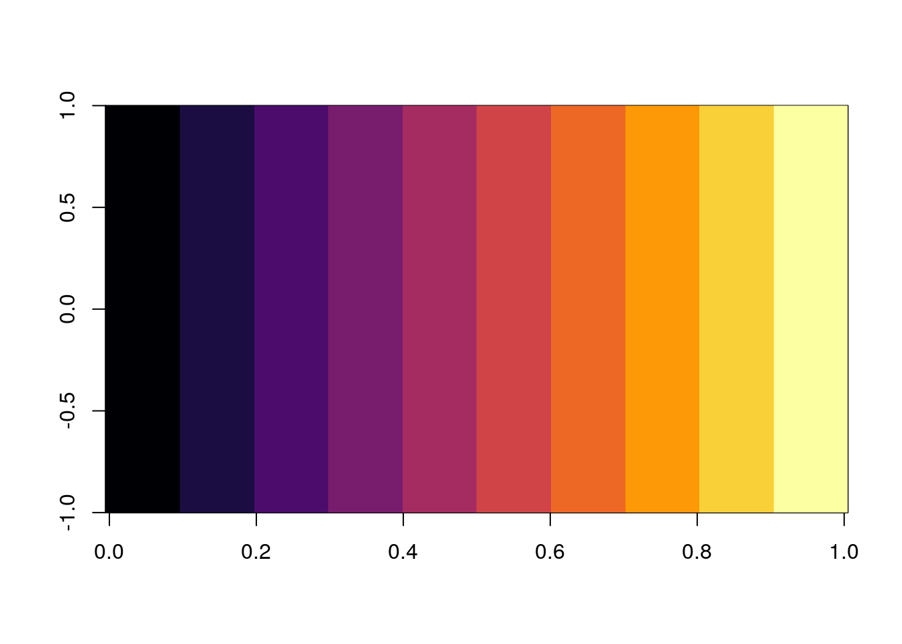
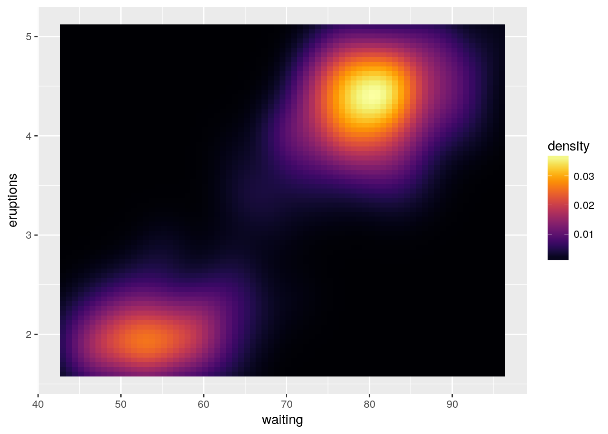
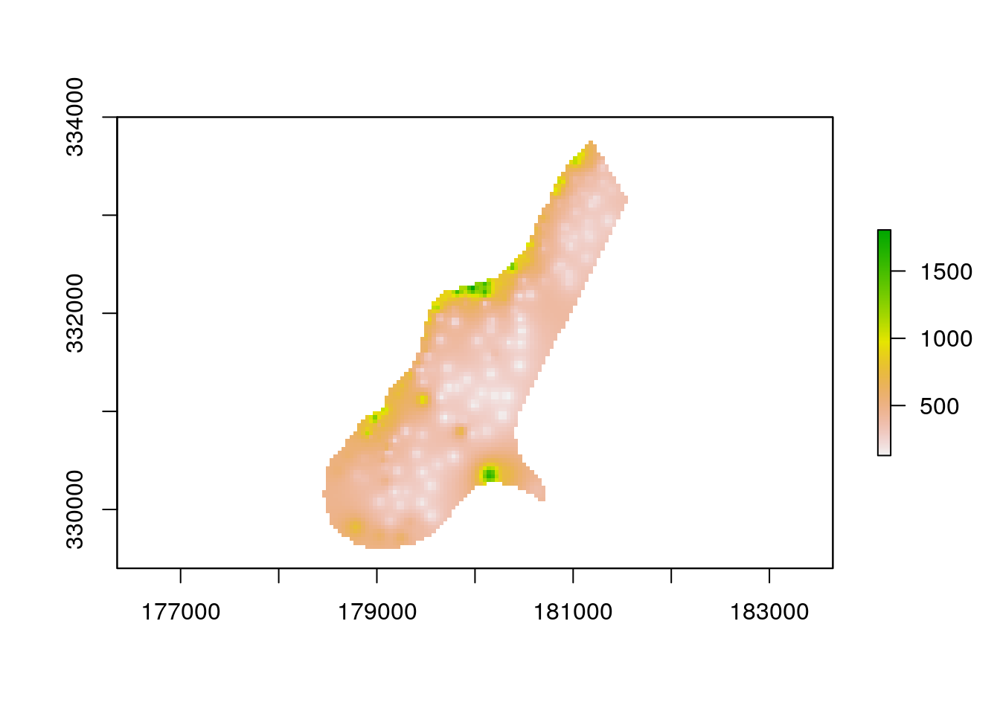
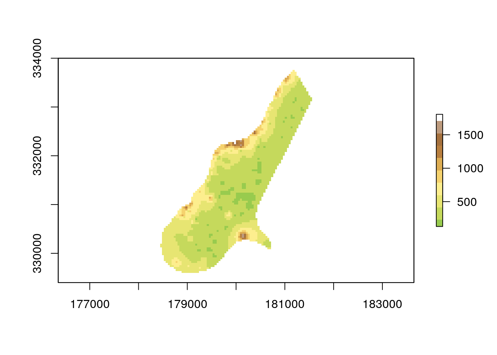
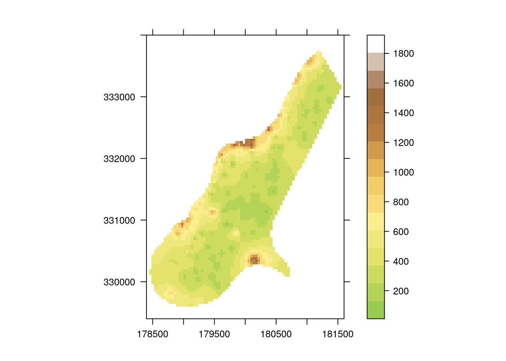

```{r setup, include=FALSE}
knitr::opts_chunk$set(echo = TRUE)
```

[](https://travis-ci.org/ibarraespinosa/cptcity)
[](https://ci.appveyor.com/project/ibarraespinosa/cptcity)
[](http://cran.rstudio.com/web/packages/cptcity/index.html)
[](http://www.rdocumentation.org/packages/cptcity)

## A package to return colour gradients from CPTCITY

Colour palletes comes from http://soliton.vm.bytemark.co.uk/pub/cpt-city/index.html

Currently gradients:

- "inferno"
- "temperature"
- "sst"
- "temp"
- "arendarl_arctic"
- "arendarl_temperature"
- "arendarl_zambezi_focus"
- "arendarl_zambezi_proximity"

The main

## Install and use it!

```{r eval = FALSE}
# devtools::install_github("ibarraespinosa/cptcity")
library(cptcity)
image(matrix(1:100), col = cpt(pal = "inferno"))
```

And you can use it ggplot2
```{r eval = FALSE}
library(cptcity)
library(ggplot2)
ggplot(faithfuld, aes(waiting, eruptions)) +
  geom_raster(aes(fill = density))

ggplot(faithfuld, aes(waiting, eruptions)) +
  geom_raster(aes(fill = density)) +
  scale_fill_gradientn(colours = cpt(n = 100))
```





or raster
```{r eval = FALSE}
library(cptcity)
library(raster)
f <- system.file("external/test.grd", package="raster")
r <- raster(f)
plot(r)
plot(r, col = rev(cpt(pal = "arendarl_zambezi_focus")))
spplot(r, scales = list(draw = T),
       col.regions = rev(cpt(n = 100, pal = "arendarl_zambezi_focus")))
```






