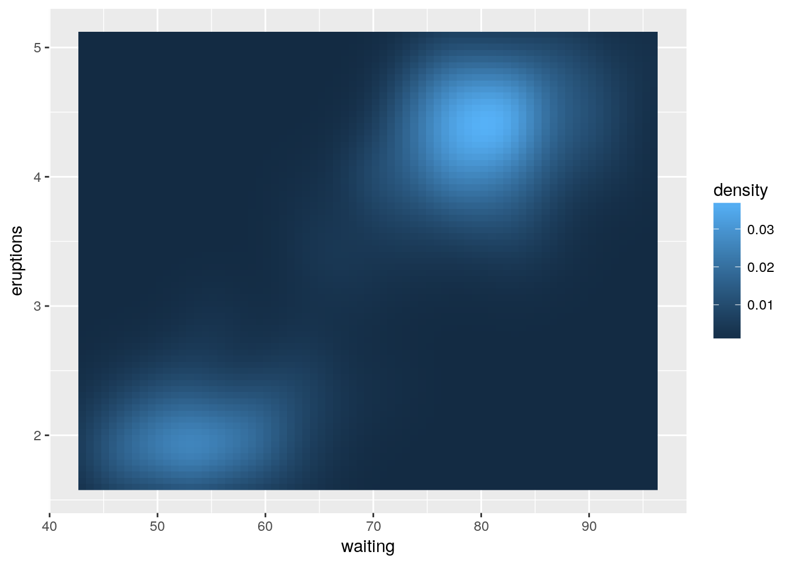
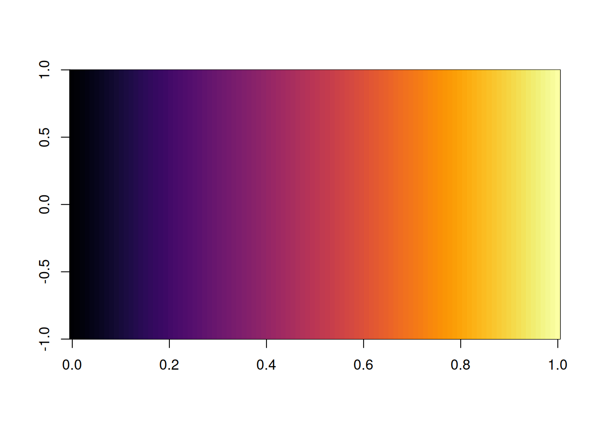
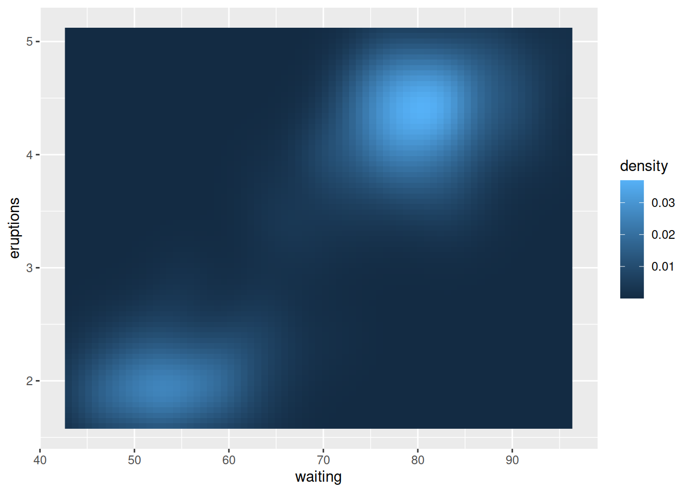
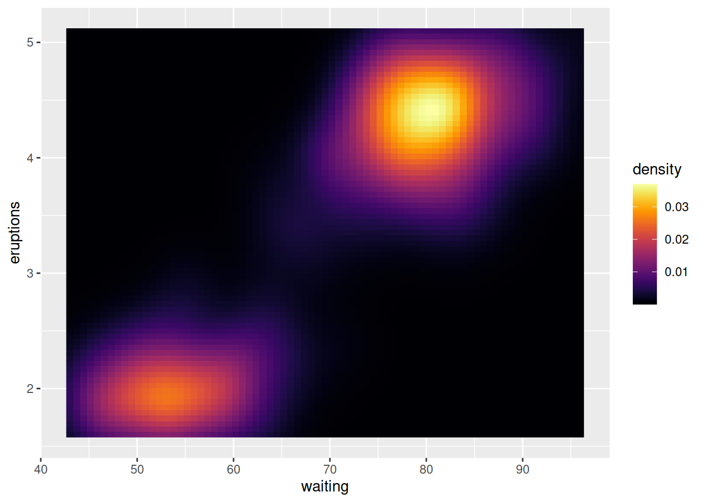

[](https://travis-ci.org/ibarraespinosa/cptcity)
[](https://ci.appveyor.com/project/ibarraespinosa/cptcity)
[](http://cran.rstudio.com/web/packages/cptcity/index.html)
[](http://www.rdocumentation.org/packages/cptcity)
[](https://zenodo.org/badge/latestdoi/120517547)
[](https://codecov.io/github/ibarraespinosa/cptcity?branch=master)

## A package to return colour gradients from CPTCITY

Colour palletes comes from http://soliton.vm.bytemark.co.uk/pub/cpt-city/index.html

Currently there are 7140 colour gradients. To se the names type `cpt_names`.

There are two functions:

- `find_cpt`: To search the name of the colour gradient.

Example:


```r
cpt::find_cpt("radar")
[1] "idv_radar_dbz_nws"    "idv_radar_dbz"        "idv_radar_reflect_24" "idv_radar_topo_mdr"  
[5] "ncl_radar_1"          "ncl_radar"   
```


- `cpt`: To return the colour gradient.


```r
cptcity::cpt(pal = "ncl_radar_1", n = 100)
```

```
##   [1] "#B2F8FF" "#B2F8FF" "#B2F8FF" "#B2DCFF" "#B2BEFF" "#B2B8FF" "#B2B8FF"
##   [8] "#A088EE" "#8742D7" "#7D25CD" "#7D25CD" "#7322BE" "#601D9E" "#541A8B"
##  [15] "#541A8B" "#66328A" "#AF9387" "#EDE685" "#EDE685" "#ECE584" "#DDD67C"
##  [22] "#CDC673" "#CDC673" "#CDC673" "#B7B380" "#9D9C91" "#969696" "#969696"
##  [29] "#B4B4B4" "#E6E6E6" "#FFFFFF" "#FFFFFF" "#EEFFFF" "#C6FFFF" "#AAFFFF"
##  [36] "#AAFFFF" "#A2F6FF" "#79C9FF" "#55A0FF" "#55A0FF" "#55A0FF" "#3A55FF"
##  [43] "#2009FF" "#1D00FF" "#1D00FF" "#4053C3" "#6EBF75" "#7EE55B" "#7EE55B"
##  [50] "#71DE54" "#5AD249" "#4ECC43" "#4ECC43" "#48C741" "#39BB3C" "#2EB239"
##  [57] "#2EB239" "#2DB039" "#25A43B" "#1E993D" "#1E993D" "#1E993D" "#7FC54E"
##  [64] "#EAF562" "#FFFF66" "#FFFF66" "#FFED66" "#FFD566" "#FFCC66" "#FFCC66"
##  [71] "#FFBC5F" "#FF9B53" "#FF884C" "#FF884C" "#FF7945" "#FF442D" "#FF1919"
##  [78] "#FF1919" "#FD1A1A" "#E52B2B" "#CD3C3C" "#CC3D3D" "#CC3D3D" "#BC3838"
##  [85] "#A93232" "#A53131" "#A53131" "#BA2269" "#DD0AC3" "#ED00ED" "#ED00ED"
##  [92] "#D814E6" "#A945D7" "#8967CD" "#8967CD" "#9474CF" "#CAB5DB" "#FAF0E6"
##  [99] "#FAF0E6" "#FAF0E6"
```

## Install and use it!


```r
# devtools::install_github("ibarraespinosa/cptcity")
library(cptcity)
image(matrix(1:100), col = cpt(pal = "mpl_inferno"))
```


And you can use it ggplot2

```r
library(cptcity)
library(ggplot2)
ggplot(faithfuld, aes(waiting, eruptions)) +
  geom_raster(aes(fill = density))
```




```r
ggplot(faithfuld, aes(waiting, eruptions)) +
  geom_raster(aes(fill = density)) +
  scale_fill_gradientn(colours = cpt(n = 100))
```




or raster

```r
library(cptcity)
library(raster)
```

```
## Loading required package: sp
```

```r
f <- system.file("external/test.grd", package="raster")
r <- raster(f)
spplot(r, scales = list(draw = T))
```




```r
spplot(r, scales = list(draw = T),
       col.regions = rev(cpt(n = 100, pal = "arendal_zambezi_focus")))
```




Each pallete has a COPYING.XML files available at ins/extdata. To see each file do:


```r
library(cptcity)
files <- list.files(system.file("extdata",
                                package = "cptcity"),
                    pattern = ".xml",
                    recursive = T,
                    full.names = T)
# For instance, the COPYING files of "arendal" is
files[1]
```

```
## [1] "/home/sergio/R/x86_64-pc-linux-gnu-library/3.4/cptcity/extdata/arendal/COPYING.xml"
```

```r
# and the file
readLines(files[1])
```

```
##  [1] "<?xml version=\"1.0\"?>"                                                                        
##  [2] "<copying>"                                                                                      
##  [3] "  <authors>"                                                                                    
##  [4] "    <author href=\"http://www.grida.no/graphicslib/\">"                                         
##  [5] "      <name>GRID-Arendal</name>"                                                                
##  [6] "    </author>"                                                                                  
##  [7] "  </authors>"                                                                                   
##  [8] "  <license>"                                                                                    
##  [9] "    <informal>"                                                                                 
## [10] "      Attribution and linkback requested."                                                      
## [11] "    </informal>"                                                                                
## [12] "    <year>2014</year>"                                                                          
## [13] "    <text>"                                                                                     
## [14] "      Using this graphic and referring to it is encouraged, "                                   
## [15] "      and please use it in presentations, web pages, newspapers, "                              
## [16] "      blogs and reports."                                                                       
## [17] ""                                                                                               
## [18] "      For any form of publication, please include the link to "                                 
## [19] "      this page and give the cartographer/designer credit."                                     
## [20] "    </text>"                                                                                    
## [21] "  </license>"                                                                                   
## [22] "  <src>"                                                                                        
## [23] "    <format>PNG images</format>"                                                                
## [24] "    <link href=\"http://www.grida.no/graphicslib/detail/mean-surface-temperature_c7e4\""        
## [25] "\t  >Temperature</link>"                                                                        
## [26] "    <link href=\"http://www.grida.no/graphicslib/detail/arctic-topography-and-bathymetry_5645\""
## [27] "\t  >Arctic bathymetry</link>"                                                                  
## [28] "    <link href=\"http://www.grida.no/graphicslib/detail/map-of-zimbabwe_36a5\""                 
## [29] "\t  >Zambezi</link>"                                                                            
## [30] "  </src>"                                                                                       
## [31] "  <distribute>"                                                                                 
## [32] "    <qgis distribute=\"yes\" license=\"other\"/>"                                               
## [33] "  </distribute>"                                                                                
## [34] "</copying>"
```

