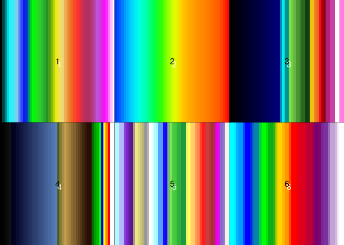
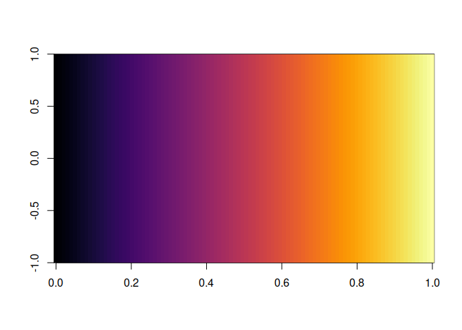
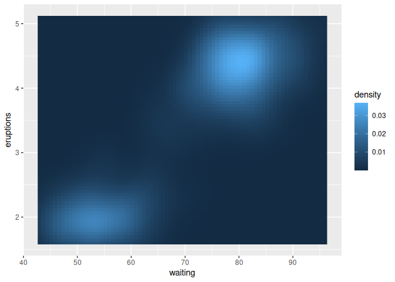
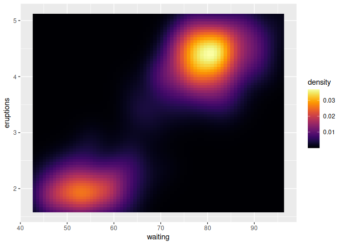
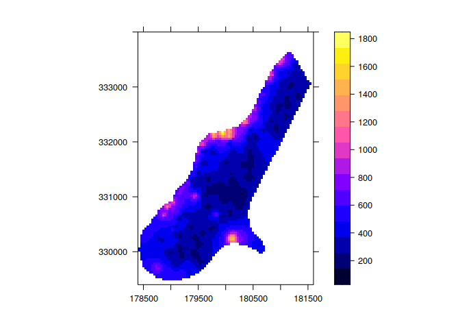
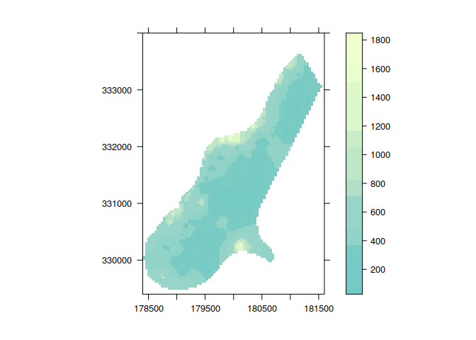
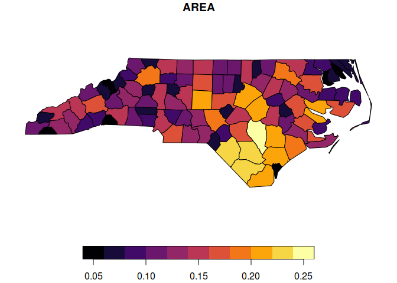
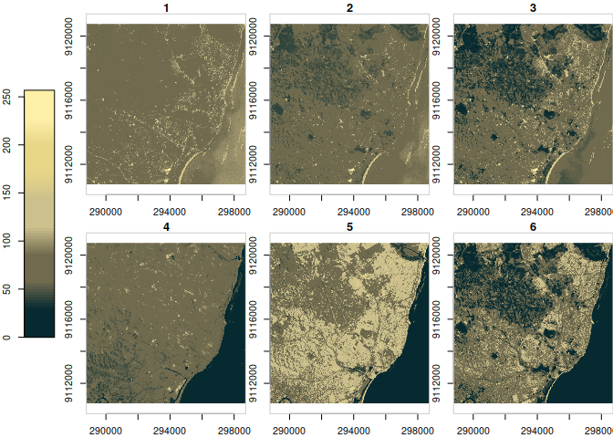
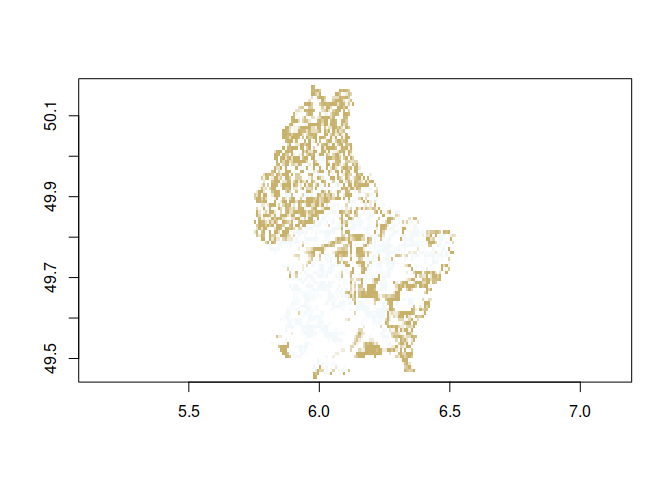

cptcity package
================
Sergio Ibarra-Espinosa
2023-08-13


[](https://travis-ci.org/ibarraespinosa/cptcity)
[](https://ci.apalettepveyor.com/project/ibarraespinosa/cptcity)
[](https://zenodo.org/badge/latestdoi/120517547)
[](https://codecov.io/github/ibarraespinosa/cptcity?branch=master)
[](http://cran.rstudio.com/web/packages/cptcity/index.html)
[](http://www.rdocumentation.org/packages/cptcity)
[](http://cran.r-project.org/web/packages/cptcity)
[](http://cran.r-project.org/package=cptcity)

## A package to return colour gradients from CPTCITY

Colour palettes comes from
<http://soliton.vm.bytemark.co.uk/pub/cpt-city/index.html>

Currently there are 7140 colour gradients. To se the names type
`cpt_names`.

There are three functions:

1)  `find_cpt`: To search the name of the colour gradient.

Example:

``` r
library(cptcity)
find_cpt("radar")
```

    ## [1] "idv_radar_dbz_nws"    "idv_radar_dbz"        "idv_radar_reflect_24"
    ## [4] "idv_radar_topo_mdr"   "ncl_radar_1"          "ncl_radar"

2)  `show_cpt`: Visually selectyour palette

``` r
pals <- find_cpt("radar")
show_cpt(pals)
```

    ## Creating  2 3 matrix

<!-- -->

3)  `cpt`: To return the colour gradient.

``` r
cptcity::cpt(pal = "ncl_radar_1", n = 100)
```

    ##   [1] "#B2F8FF" "#B2F8FF" "#B2F8FF" "#B2DCFF" "#B2BEFF" "#B2B8FF" "#B2B8FF"
    ##   [8] "#A088EE" "#8742D7" "#7D25CD" "#7D25CD" "#7322BE" "#601D9E" "#541A8B"
    ##  [15] "#541A8B" "#66328A" "#AF9387" "#EDE685" "#EDE685" "#ECE584" "#DDD67C"
    ##  [22] "#CDC673" "#CDC673" "#CDC673" "#B7B380" "#9D9C91" "#969696" "#969696"
    ##  [29] "#B4B4B4" "#E6E6E6" "#FFFFFF" "#FFFFFF" "#EEFFFF" "#C6FFFF" "#AAFFFF"
    ##  [36] "#AAFFFF" "#A2F6FF" "#79C9FF" "#55A0FF" "#55A0FF" "#55A0FF" "#3A55FF"
    ##  [43] "#2009FF" "#1D00FF" "#1D00FF" "#4053C3" "#6EBF75" "#7EE55B" "#7EE55B"
    ##  [50] "#71DE54" "#5AD249" "#4ECC43" "#4ECC43" "#48C741" "#39BB3C" "#2EB239"
    ##  [57] "#2EB239" "#2DB039" "#25A43B" "#1E993D" "#1E993D" "#1E993D" "#7FC54E"
    ##  [64] "#EAF562" "#FFFF66" "#FFFF66" "#FFED66" "#FFD566" "#FFCC66" "#FFCC66"
    ##  [71] "#FFBC5F" "#FF9B53" "#FF884C" "#FF884C" "#FF7945" "#FF442D" "#FF1919"
    ##  [78] "#FF1919" "#FD1A1A" "#E52B2B" "#CD3C3C" "#CC3D3D" "#CC3D3D" "#BC3838"
    ##  [85] "#A93232" "#A53131" "#A53131" "#BA2269" "#DD0AC3" "#ED00ED" "#ED00ED"
    ##  [92] "#D814E6" "#A945D7" "#8967CD" "#8967CD" "#9474CF" "#CAB5DB" "#FAF0E6"
    ##  [99] "#FAF0E6" "#FAF0E6"

4)  `lucky`: To choose a random colour gradient

``` r
cptcity::lucky(n = 100)
```

    ## Colour gradient: nd_basic_Blue_White_Red, number: 5194

    ##   [1] "#0000FF" "#0505FF" "#0A0AFF" "#0F0FFF" "#1414FF" "#1919FF" "#1F1FFF"
    ##   [8] "#2424FF" "#2929FF" "#2E2EFF" "#3333FF" "#3838FF" "#3E3EFF" "#4343FF"
    ##  [15] "#4848FF" "#4D4DFF" "#5252FF" "#5757FF" "#5D5DFF" "#6262FF" "#6767FF"
    ##  [22] "#6C6CFF" "#7171FF" "#7676FF" "#7C7CFF" "#8181FF" "#8686FF" "#8B8BFF"
    ##  [29] "#9090FF" "#9595FF" "#9A9AFF" "#A0A0FF" "#A5A5FF" "#AAAAFF" "#AFAFFF"
    ##  [36] "#B4B4FF" "#B9B9FF" "#BEBEFF" "#C3C3FF" "#C9C9FF" "#CECEFF" "#D3D3FF"
    ##  [43] "#D8D8FF" "#DDDDFF" "#E2E2FF" "#E7E7FF" "#EDEDFF" "#F2F2FF" "#F7F7FF"
    ##  [50] "#FCFCFF" "#FFFCFC" "#FFF7F7" "#FFF2F2" "#FFEDED" "#FFE7E7" "#FFE2E2"
    ##  [57] "#FFDDDD" "#FFD8D8" "#FFD3D3" "#FFCECE" "#FFC9C9" "#FFC3C3" "#FFBEBE"
    ##  [64] "#FFB9B9" "#FFB4B4" "#FFAFAF" "#FFAAAA" "#FFA5A5" "#FFA0A0" "#FF9A9A"
    ##  [71] "#FF9595" "#FF9090" "#FF8B8B" "#FF8686" "#FF8181" "#FF7C7C" "#FF7676"
    ##  [78] "#FF7171" "#FF6C6C" "#FF6767" "#FF6262" "#FF5D5D" "#FF5757" "#FF5252"
    ##  [85] "#FF4D4D" "#FF4848" "#FF4343" "#FF3E3E" "#FF3838" "#FF3333" "#FF2E2E"
    ##  [92] "#FF2929" "#FF2424" "#FF1F1F" "#FF1919" "#FF1414" "#FF0F0F" "#FF0A0A"
    ##  [99] "#FF0505" "#FF0000"

## Install and use it!

``` r
# install.packages("cptcity") 1.0.6
# remotes::install_github("ibarraespinosa/cptcity") 
packageVersion("cptcity")
```

    ## [1] '1.1.0'

``` r
library(cptcity)
image(matrix(1:100), col = cpt(pal = "mpl_inferno"))
```

<!-- -->

## ggplot2

And you can use it ggplot2

``` r
library(cptcity)
library(ggplot2)
ggplot(faithfuld, aes(waiting, eruptions)) +
  geom_raster(aes(fill = density))
```

<!-- -->

``` r
ggplot(faithfuld, aes(waiting, eruptions)) +
  geom_raster(aes(fill = density)) +
  scale_fill_gradientn(colours = cpt())
```

<!-- -->

## raster

``` r
library(cptcity)
library(raster)
```

    ## Loading required package: sp

    ## The legacy packages maptools, rgdal, and rgeos, underpinning the sp package,
    ## which was just loaded, will retire in October 2023.
    ## Please refer to R-spatial evolution reports for details, especially
    ## https://r-spatial.org/r/2023/05/15/evolution4.html.
    ## It may be desirable to make the sf package available;
    ## package maintainers should consider adding sf to Suggests:.
    ## The sp package is now running under evolution status 2
    ##      (status 2 uses the sf package in place of rgdal)

``` r
f <- system.file("external/test.grd", package="raster")
r <- raster(f)
spplot(r, scales = list(draw = T))
```

<!-- -->

``` r
spplot(r, scales = list(draw = T),
       col.regions = rev(cpt(n = 100, pal = "colo_Skyblue2u_Gentle_Waves")))
```

<!-- -->

## sf

``` r
library(cptcity)
library(sf)
```

    ## Linking to GEOS 3.11.1, GDAL 3.6.2, PROJ 9.1.1; sf_use_s2() is TRUE

``` r
nc = st_read(system.file("shape/nc.shp", package="sf"))
```

    ## Reading layer `nc' from data source 
    ##   `/home/sergio/R/x86_64-pc-linux-gnu-library/4.2/sf/shape/nc.shp' 
    ##   using driver `ESRI Shapefile'
    ## Simple feature collection with 100 features and 14 fields
    ## Geometry type: MULTIPOLYGON
    ## Dimension:     XY
    ## Bounding box:  xmin: -84.32385 ymin: 33.88199 xmax: -75.45698 ymax: 36.58965
    ## Geodetic CRS:  NAD27

``` r
plot(nc["AREA"], pal = cpt(colorRampPalette = T))
```

<!-- -->

## mapview

``` r
library(cptcity)
library(mapview)
library(sf)
nc = st_read(system.file("shape/nc.shp", package="sf"))
mapview(nc, zcol = "AREA", col.regions = cpt(colorRampPalette = T), legend = T)
```


## stars

``` r
library(cptcity)
library(stars)
```

    ## Loading required package: abind

``` r
tif = system.file("tif/L7_ETMs.tif", package = "stars")
(x1 = read_stars(tif))
```

    ## stars object with 3 dimensions and 1 attribute
    ## attribute(s):
    ##              Min. 1st Qu. Median     Mean 3rd Qu. Max.
    ## L7_ETMs.tif     1      54     69 68.91242      86  255
    ## dimension(s):
    ##      from  to  offset delta                     refsys point x/y
    ## x       1 349  288776  28.5 SIRGAS 2000 / UTM zone 25S FALSE [x]
    ## y       1 352 9120761 -28.5 SIRGAS 2000 / UTM zone 25S FALSE [y]
    ## band    1   6      NA    NA                         NA    NA

``` r
br <- classInt::classIntervals(var = x1$L7_ETMs.tif, 
                               n = 100, 
                               style = "sd")
plot(x1,
     axes = TRUE,
     lty = 0,
     col = cptcity::cpt(rev = TRUE, 
                        pal = 819,
                        n = length(br$brks) - 1),
     key.pos = 2,
     breaks = br$brks
     )
```

<!-- -->

## terra

``` r
library(cptcity)
library(terra)
```

    ## terra 1.7.37

``` r
f <- system.file("ex/elev.tif", package="terra")
r <- rast(f)
image(r, col = cptcity::lucky())
```

    ## Colour gradient: gacruxa_calamba_calamba_02, number: 2252

<!-- -->

``` r
# Colour gradient: dca_alarm.p4.0.1, number: 1115 
```

# **I included a random colour gradient function!**

``` r
# install.packages("cptcity")
# devtools::install_github("ibarraespinosa/cptcity")
library(cptcity)
image(matrix(1:100), col = lucky())
```

## COPYING

Each palette has a COPYING.XML files available at ins/extdata. To see
each file do:

``` r
library(cptcity)
files <- list.files(system.file("extdata",
                                package = "cptcity"),
                    pattern = ".xml",
                    recursive = T,
                    full.names = T)
# For instance, the COPYING files of "arendal" is
files[1]
# and the file
readLines(files[1])
1] "/usr/local/lib/R/site-library/cptcity/extdata/arendal/COPYING.xml"
 [1] "<?xml version=\"1.0\"?>"                                                                        
 [2] "<copying>"                                                                                      
 [3] "  <authors>"                                                                                    
 [4] "    <author href=\"http://www.grida.no/graphicslib/\">"                                         
 [5] "      <name>GRID-Arendal</name>"                                                                
 [6] "    </author>"                                                                                  
 [7] "  </authors>"                                                                                   
 [8] "  <license>"                                                                                    
 [9] "    <informal>"                                                                                 
[10] "      Attribution and linkback requested."                                                      
[11] "    </informal>"                                                                                
[12] "    <year>2014</year>"                                                                          
[13] "    <text>"                                                                                     
[14] "      Using this graphic and referring to it is encouraged, "                                   
[15] "      and please use it in presentations, web pages, newspapers, "                              
[16] "      blogs and reports."                                                                       
[17] ""                                                                                               
[18] "      For any form of publication, please include the link to "                                 
[19] "      this page and give the cartographer/designer credit."                                     
[20] "    </text>"                                                                                    
[21] "  </license>"                                                                                   
[22] "  <src>"                                                                                        
[23] "    <format>PNG images</format>"                                                                
[24] "    <link href=\"http://www.grida.no/graphicslib/detail/mean-surface-temperature_c7e4\""        
[25] "\t  >Temperature</link>"                                                                        
[26] "    <link href=\"http://www.grida.no/graphicslib/detail/arctic-topography-and-bathymetry_5645\""
[27] "\t  >Arctic bathymetry</link>"                                                                  
[28] "    <link href=\"http://www.grida.no/graphicslib/detail/map-of-zimbabwe_36a5\""                 
[29] "\t  >Zambezi</link>"                                                                            
[30] "  </src>"                                                                                       
[31] "  <distribute>"                                                                                 
[32] "    <qgis distribute=\"yes\" license=\"other\"/>"                                               
[33] "  </distribute>"                                                                                
[34] "</copying>"  
```
