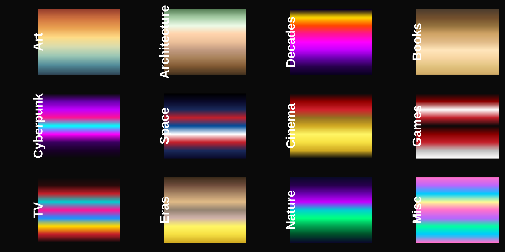
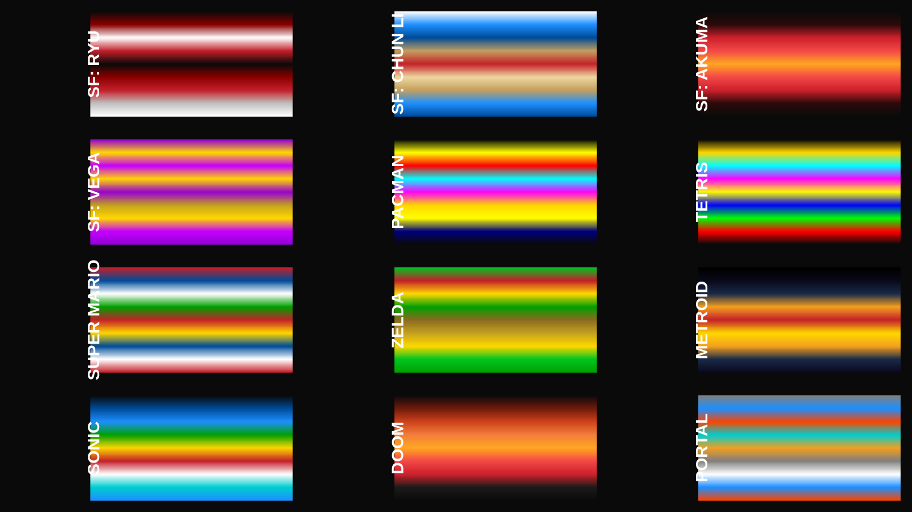
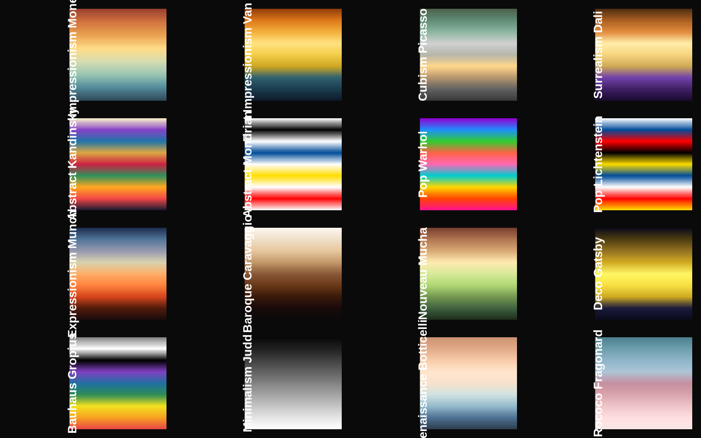
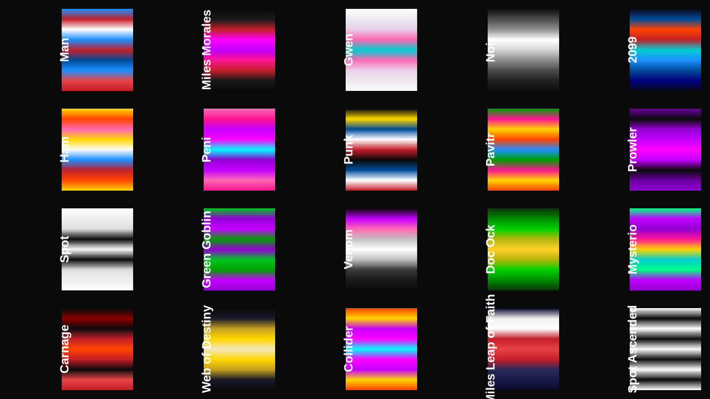

# cptcity 

**7,489 colour palettes for R — from scientific gradients to the Spider-Verse.**

[](http://cran.r-project.org/web/packages/cptcity)
[](http://cran.r-project.org/package=cptcity)
[](https://zenodo.org/badge/latestdoi/120517547)

---

## What's inside

The classic 7140 gradients from the [cpt-city archive](https://phillips.shef.ac.uk/pub/cpt-city/) — plus **349 curated palettes** across 26 categories: art, architecture, decades, books, cyberpunk, space agencies, video games, cinema, music, anime, cities, mythology, science, Brazil, films, gemstones, weather, comics, food, albums, photography, and the entire **Spider-Verse.**

<p align="center">
  
</p>

---

## Four functions. That's it.

| Function | What it does |
|---|---|
| `cpt(pal, n, colorRampPalette, rev, frgb)` | Returns a colour gradient — character vector or `colorRampPalette` function |
| `find_cpt(keyword)` | Searches 7288 palette names (case-insensitive) |
| `show_cpt(names)` | Displays palettes side-by-side as colour bars |
| `lucky()` | Random palette — "I'm Feeling Lucky" for colours |

```r
library(cptcity)

# Search
find_cpt("cyberpunk")     # → cyber_2077_night_city

# Get colours
cols <- cpt("cyber_2077_night_city", n = 100)

# Preview
show_cpt(find_cpt("street_fighter"))
```

---

## The new v2 palettes

### 🎮 Games



Street Fighter, Pac-Man, Tetris, Mario, Zelda, Metroid, Sonic, Doom, Portal — arcade history in colour.

```r
plot(nc["AREA"], pal = cpt("game_pacman", colorRampPalette = TRUE))
```

### 🚀 Space agencies


NASA, NOAA, JAXA, ESA, SpaceX, Roscosmos. Plus Hubble, JWST, Mars Rover, Apollo, Voyager.

### 🎨 Art movements



16 movements: Impressionism (Monet), Van Gogh, Cubism (Picasso), Surrealism (Dalí), Kandinsky, Mondrian, Pop Art (Warhol), Expressionism (Munch), Baroque, Art Nouveau, Art Deco, Bauhaus, Minimalism, Renaissance, Rococo.

### ⏳ Decades timeline


From 1920s Gatsby to 2020s gradient design. Each era's aesthetic distilled into a colour ramp.

### 🌃 Works with sf and ggplot2

```r
library(sf)
nc <- st_read(system.file("shape/nc.shp", package = "sf"))
plot(nc["AREA"], pal = cpt("cyber_2077_night_city", colorRampPalette = TRUE))
```

### More categories

| Prefix | Palettes | Example |
|---|---|---|
| `book_` | 14 | `book_dune_arrakis`, `book_neuromancer`, `book_1984_orwell` |
| `cyber_` | 7 | `cyber_2077_night_city`, `cyber_blade_runner`, `cyber_matrix` |
| `cinema_` | 8 | `cinema_mgm_lion`, `cinema_technicolor`, `cinema_film_noir` |
| `arch_` | 12 | `arch_fallingwater_wright`, `arch_sagrada_familia_gaudi` |
| `tv_` | 8 | `tv_stranger_things`, `tv_twin_peaks`, `tv_x_files` |
| `era_` | 9 | `era_ancient_egypt`, `era_wild_west`, `era_industrial` |
| `nature_` | 14 | `nature_aurora_borealis`, `nature_coral_reef`, `nature_nebula` |
| `misc_` | 8 | `misc_vaporwave`, `misc_outrun`, `misc_steampunk` |

### 🕷️ Spider-Verse — 63 palettes



Every dimension. Every character. Heroes, villains, worlds, and the Web of Destiny itself.

**Heroes:** `spider_man`, `spider_miles_morales`, `spider_gwen`, `spider_noir`, `spider_2099`, `spider_punk`, `spider_pavitr`, `spider_ham`, `spider_peni`, `spider_scarlet`, `spider_superior`, `spider_byte`, `spider_1602`

**Family & Allies:** `spider_prowler`, `spider_rio_morales`, `spider_jefferson_davis`, `spider_aunt_may`, `spider_jessica_drew`, `spider_peter_b_parker`, `spider_mayday`

**Villains:** `spider_spot`, `spider_green_goblin`, `spider_venom`, `spider_doc_ock`, `spider_kingpin`, `spider_mysterio`, `spider_sandman`, `spider_electro`, `spider_carnage`, `spider_scorpion`

**Dimensions & Worlds:** `spider_earth_1610`, `spider_earth_65`, `spider_earth_90214`, `spider_earth_928`, `spider_earth_50101`, `spider_mumbattan`, `spider_nueva_york`, `spider_gwen_world`, `spider_brooklyn`

**Cosmic:** `spider_web_of_destiny`, `spider_great_web`, `spider_portal`, `spider_collider`, `spider_glitch`, `spider_multiverse`, `spider_interdimensional`

```r
# That "leap of faith" moment
image(matrix(1:100), col = cpt("spider_miles_leap_of_faith"))

# The Spot — reality-breaking black and white
image(matrix(1:100), col = cpt("spider_spot_ascended"))

# Map North Carolina in Spider-Gwen colors
plot(nc["AREA"], pal = cpt("spider_gwen", colorRampPalette = TRUE))
```

---

## Installation

```r
install.packages("cptcity")           # CRAN
# or
remotes::install_github("ibarraespinosa/cptcity")
```

```r
library(cptcity)

# Classic cpt-city palette
image(matrix(1:100), col = cpt("mpl_inferno"))

# v2 palette
image(matrix(1:100), col = cpt("decade_1980s_synthwave"))
```

---

## Dependencies

Exactly one: `grDevices` (ships with R). Zero bloat.

---

## Citation

```r
citation("cptcity")
```

> Sergio Ibarra-Espinosa (2026). cptcity: incorporating the cpt-city archive into R. R package version 2.0.0. https://CRAN.R-project.org/package=cptcity

---

## License

GPL-3 · Palettes retain their original licenses (documented in `inst/extdata/`).

---

<p align="center">
  <sub>Made with <code>cpt("spider_miles_morales")</code> · <a href="https://phillips.shef.ac.uk/pub/cpt-city/">cpt-city archive</a> · 7,489 gradients and counting</sub>
</p>
