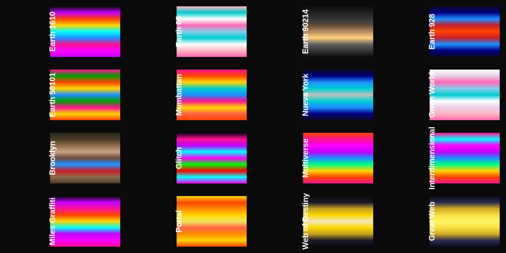

# cptcity 

**7,489 colour palettes for R — from scientific gradients to the Spider-Verse.**

[](http://cran.r-project.org/web/packages/cptcity)
[](http://cran.r-project.org/package=cptcity)
[](https://zenodo.org/badge/latestdoi/120517547)

---

## What's inside

The classic 7140 gradients from the [cpt-city archive](https://phillips.shef.ac.uk/pub/cpt-city/) — plus **349 curated palettes** across 26 categories: art, architecture, decades, books, cyberpunk, space agencies, video games, cinema, music, anime, cities, mythology, science, Brazil, films, gemstones, weather, comics, food, albums, photography, and the entire **Spider-Verse.**

<p align="center">
  
</p>

---

## Four functions. That's it.

| Function | What it does |
|---|---|
| `cpt(pal, n, colorRampPalette, rev, frgb)` | Returns a colour gradient — character vector or `colorRampPalette` function |
| `find_cpt(keyword)` | Searches 7288 palette names (case-insensitive) |
| `show_cpt(names)` | Displays palettes side-by-side as colour bars |
| `lucky()` | Random palette — "I'm Feeling Lucky" for colours |

```r
library(cptcity)

# Search
find_cpt("cyberpunk")     # → cyber_2077_night_city

# Get colours
cols <- cpt("cyber_2077_night_city", n = 100)

# Preview
show_cpt(find_cpt("street_fighter"))
```

---

## The new v2 palettes

### 🎮 Games


Street Fighter, Pac-Man, Tetris, Mario, Zelda, Metroid, Sonic, Doom, Portal — arcade history in colour.

```r
plot(nc["AREA"], pal = cpt("game_pacman", colorRampPalette = TRUE))
```

### 🚀 Space agencies


NASA, NOAA, JAXA, ESA, SpaceX, Roscosmos. Plus Hubble, JWST, Mars Rover, Apollo, Voyager.

### 🎨 Art movements


16 movements: Impressionism (Monet), Van Gogh, Cubism (Picasso), Surrealism (Dalí), Kandinsky, Mondrian, Pop Art (Warhol), Expressionism (Munch), Baroque, Art Nouveau, Art Deco, Bauhaus, Minimalism, Renaissance, Rococo.

### ⏳ Decades timeline


From 1920s Gatsby to 2020s gradient design. Each era's aesthetic distilled into a colour ramp.

### 🌃 Works with sf and ggplot2

```r
library(sf)
nc <- st_read(system.file("shape/nc.shp", package = "sf"))
plot(nc["AREA"], pal = cpt("cyber_2077_night_city", colorRampPalette = TRUE))
```

### More categories

| Prefix | Palettes | Example |
|---|---|---|
| `book_` | 14 | `book_dune_arrakis`, `book_neuromancer`, `book_1984_orwell` |
| `cyber_` | 7 | `cyber_2077_night_city`, `cyber_blade_runner`, `cyber_matrix` |
| `cinema_` | 8 | `cinema_mgm_lion`, `cinema_technicolor`, `cinema_film_noir` |
| `arch_` | 12 | `arch_fallingwater_wright`, `arch_sagrada_familia_gaudi` |
| `tv_` | 8 | `tv_stranger_things`, `tv_twin_peaks`, `tv_x_files` |
| `era_` | 9 | `era_ancient_egypt`, `era_wild_west`, `era_industrial` |
| `nature_` | 14 | `nature_aurora_borealis`, `nature_coral_reef`, `nature_nebula` |
| `misc_` | 8 | `misc_vaporwave`, `misc_outrun`, `misc_steampunk` |

### 🕷️ Spider-Verse — 63 palettes. Every dimension. Every character.


The full roster. From Peter Parker's classic red-and-blue to Miles Morales' graffiti glow, Gwen's watercolor ballet world, Noir's 1930s shadows, 2099's cyber-neon, the anarchic Punk, Pavitr's vibrant Mumbattan, Peni's anime mecha, and Spider-Ham's cartoon chaos. Plus every villain that matters.

---

**👤 HEROES — 14 palettes**

| Palette | Character |
|---|---|
| `spider_man` | Peter Parker — classic red & blue |
| `spider_miles_morales` | Miles Morales — black suit, neon spray |
| `spider_gwen` | Ghost-Spider — pastel watercolor |
| `spider_noir` | 1930s monochrome detective |
| `spider_2099` | Miguel O'Hara — cyberpunk future |
| `spider_punk` | Hobie Brown — Union Jack anarchy |
| `spider_pavitr` | Spider-Man India — saffron & emerald |
| `spider_ham` | Spider-Ham — cartoon primaries |
| `spider_peni` | Peni Parker — mecha magenta |
| `spider_scarlet` | Ben Reilly — hoodie red & blue |
| `spider_superior` | Otto Octavius — darker, sharper |
| `spider_symbiote` | The black suit — sleek & alien |
| `spider_byte` | Margo Kess — digital avatar |
| `spider_1602` | Elizabethan Spider — medieval tones |

**👨‍👩‍👧 FAMILY & ALLIES — 7 palettes**

| Palette | Character |
|---|---|
| `spider_prowler` | Aaron Davis — purple menace |
| `spider_prowler_earth42` | Earth-42 Prowler — red & violet |
| `spider_rio_morales` | Rio Morales — warm Puerto Rican |
| `spider_jefferson_davis` | Jefferson Davis — police blues |
| `spider_aunt_may` | Aunt May — gentle earth tones |
| `spider_jessica_drew` | Spider-Woman — yellow & green |
| `spider_peter_b_parker` | Washed-up Peter — robe & regret |
| `spider_mayday` | Mayday Parker — baby Spider |

**🦹 VILLAINS — 12 palettes**

| Palette | Character |
|---|---|
| `spider_spot` | The Spot — white void, black dots |
| `spider_spot_ascended` | The Spot (full power) — reality-breaking B&W |
| `spider_green_goblin` | Norman Osborn — purple & green |
| `spider_venom` | The symbiote — black with pink tongue |
| `spider_carnage` | Cletus Kasady — blood red chaos |
| `spider_doc_ock` | Doc Ock — metallic green tentacles |
| `spider_kingpin` | Wilson Fisk — imposing white & black |
| `spider_mysterio` | Quentin Beck — illusion purple & gold |
| `spider_sandman` | Flint Marko — desert earth |
| `spider_electro` | Max Dillon — electric blue |
| `spider_vulture` | Adrian Toomes — deep teal |
| `spider_lizard` | Curt Connors — reptilian green |
| `spider_rhino` | Aleksei Sytsevich — grey armor |
| `spider_scorpion` | Mac Gargan — acid green & gold |
| `spider_tombstone` | Lonnie Lincoln — chalk white |

**🌐 DIMENSIONS & WORLDS — 9 palettes**

| Palette | World |
|---|---|
| `spider_earth_1610` | Miles' dimension — neon street art |
| `spider_earth_65` | Gwen's world — ballet pastels |
| `spider_earth_90214` | Noir's world — sepia shadows |
| `spider_earth_928` | 2099's Nueva York — cyber blue |
| `spider_earth_50101` | Pavitr's Mumbattan — vibrant India |
| `spider_mumbattan` | The city itself — saffron heat |
| `spider_nueva_york` | The future skyline — electric blue |
| `spider_gwen_world` | Gwen's watercolor dimension |
| `spider_brooklyn` | Miles' brownstone neighborhood |

**✨ COSMIC & EFFECTS — 10 palettes**

| Palette | What it is |
|---|---|
| `spider_web_of_destiny` | The great golden web — threads of fate |
| `spider_great_web` | The multiverse web — radiant gold |
| `spider_spider_society` | Miguel's HQ — orange & black |
| `spider_portal` | Interdimensional portal — blazing orange |
| `spider_collider` | Kingpin's collider — purple annihilation |
| `spider_go_home_machine` | The Go-Home-Machine — white-hot orange |
| `spider_glitch` | The glitch effect — RGB static |
| `spider_multiverse` | Multiverse burst — every color at once |
| `spider_interdimensional` | Between dimensions — full spectrum |
| `spider_miles_graffiti` | Miles' spray can — street art neon |
| `spider_miles_leap_of_faith` | "What's up danger" — rising into light |

---



**Every world has its own colour language.** That's the genius of the Spider-Verse films — and why these palettes exist. Earth-65 breathes in pinks and teals. Earth-90214 lives in monochrome. Earth-928 runs on cyber-blue. The Web of Destiny glows gold against infinite black.

```r
# The Spot — reality-breaking, terrifying, beautiful
image(matrix(1:100), col = cpt("spider_spot_ascended"))

# Peter Parker classic
image(matrix(1:100), col = cpt("spider_man"))

# Gwen's watercolor world
image(matrix(1:100), col = cpt("spider_gwen_world"))

# The Web of Destiny itself
image(matrix(1:100), col = cpt("spider_web_of_destiny"))

# Find all 63 spider palettes
find_cpt("^spider_")

# sf map in Spider-Gwen colors
library(sf)
nc <- st_read(system.file("shape/nc.shp", package = "sf"))
plot(nc["AREA"], pal = cpt("spider_gwen", colorRampPalette = TRUE))
```

---

## Installation

```r
install.packages("cptcity")           # CRAN
# or
remotes::install_github("ibarraespinosa/cptcity")
```

```r
library(cptcity)

# Classic cpt-city palette
image(matrix(1:100), col = cpt("mpl_inferno"))

# v2 palette
image(matrix(1:100), col = cpt("decade_1980s_synthwave"))
```

---

## Dependencies

Exactly one: `grDevices` (ships with R). Zero bloat.

---

## Citation

```r
citation("cptcity")
```

> Sergio Ibarra-Espinosa (2026). cptcity: incorporating the cpt-city archive into R. R package version 2.0.0. https://CRAN.R-project.org/package=cptcity

---

## License

GPL-3 · Palettes retain their original licenses (documented in `inst/extdata/`).

---

<p align="center">
  <sub>Made with <code>cpt("spider_miles_morales")</code> · <a href="https://phillips.shef.ac.uk/pub/cpt-city/">cpt-city archive</a> · 7,489 gradients and counting</sub>
</p>
